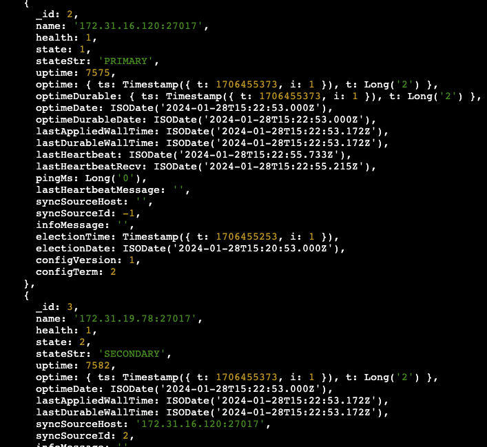

# Project : MongoDB ReplicaSet Deployment Using Ansible

## Description

This project aims to deploy a MongoDB ReplicaSet (3-Noded) on AWS Cloud Infrastructure using Ansible. Building infrastructure process is managed by control node utilizing Ansible. This infrastructure has 1 control node and 3 EC2 instances performing as worker nodes of MongoDB Replicaset. Ansible Control Node will be launched on AWS console in which Ansible and Terraform will be installed. 3 Worker Nodes will be provisioned by Terraform from Ansible Control Node. Similarly, upon provisioning three Nodes of MongoDB Replicaset, Ansible playbook files will be developed and run in order to install MongoDB, configure the Replicaset and set the networking of Worker Nodes. Data replication and failover functionality will be tested and
data replicates across nodes and secondary nodes take over upon primary failure scenarios will be ensured in accordance with the high availability and resilience of the MongoDB Replicaset. Each test scenarios and excution steps of the deployment will be documented with their expected and actual outcomes including the screenshots and images of them.


## Problem Statement and Project Solution Steps


### General Problem Statement

- The project involves setting up a MongoDB ReplicaSet with at least three nodes, consisting of one primary and two secondary nodes for data replication and high availability. Ansible is used to automate the deployment process. Virtual environments are created using AWS Cloud Infrastructure to simulate a production environment for testing purposes.

### Ansible Nodes Infrastructure Design and Terraform (IaC) Provisioning

- Ansible Control Node EC2 Instance (`Ubuntu 20.04`) and its security group allowing inbound rules 22 (SSH) and 27017 (MongoDB) from anywhere should be created on AWS console. Similarly, `EC2FullAccess` IAM Role should be attached to Ansible Control Node via console in order to access Ansible Worker Nodes.

- Security groups should be attached to EC2's with at least permission rule.

- The rest of the process has to be controlled with control node which is connected SSH port.

- Remote SSH connection to Ansible Control Node via `Visual Studio Code` (IDE) is required. 

- Terraform and Ansible tools should be installed in Ansible Control Node. 

- The folders of `ansible` and `terraform` including related terraform and ansible-playbook files should be copied to Ansible Control Node home folder (`/home/ubuntu`).

- Your AWS private key file (`xxxxxx.pem`) should be securely copied to /home/ubuntu/.ssh folder.

- Three Ansible Worker Nodes (1 Primary and 2 Secondary MongoDB Nodes) should be provisioned with `Terraform` using security group that accepts traffic from the ports 22 (SSH) and 27017 (MongoDB). The `terraform init / apply` commands should be run in the `/home/ubuntu/terraform` folder in Ansible Control Node (EC2 instance).

### MongoDB ReplicaSet Deployment with Ansible

- All process has to be controlled into the `Ansible Control Node`

- Ansible config file `ansible.cfg` has to be placed in the Ansible Control Node as explained below in Project Skeleton.

- MongoDB ReplicaSet configuration should be verified with one primary and two secondary nodes in accordance with the `inventory.tmpl` file which is used in `outputs.tf` file and copied in `/home/ubuntu/ansible/inventory`.

- `initreplica.js.j2` and `mongod.conf.j2` files in templates folders of installation and initreplica role folders are configured according to the ansible nodes structure. Separate mongodb.conf.j2 files are populated  for primary and secondary nodes for `localhost` (127.0.0.1) and `private IPs`  of each Absible Node in accordance with the MongoDB ReplicaSet secure networking.

- `MongoDB ReplicaSet` across EC2 Instances should be deployed by using Ansible-playbook file(s) (`main.yaml`) including MongoDB installation and initreplica ansible roles with required ansible tasks which are already in `/home/ubuntu/ansible` folder (i.e.: `ansible-playbook main.yaml`).

- Ansible Worker Nodes (MongoDB Replicaset Nodes with `1 Primary and 2 Secondary Nodes` ; ansible_mongodb1, ansible_mongodb2 and ansible_mongodb3) should be verified and checked from AWS console via `EC2 Service` and `EC2 Instance Connect` if the ansible tasks/roles (installation and initreplica) worked properly and/or MongoDB ReplicaSet is successfully deployed or not.

### Testing MongoDB ReplicaSet 

- `Data replication` across nodes within the MongoDB Replicaset and one of the secondary node's take-over upon primary node's failure should be tested.

  * A new database (alptestdb) and collection (testcollection) is created and an item is inserted in rs1 MongoDB ReplicaSet `Primary Node`:
  
  

  * `Secondary Node-1` is tested and the new database (alptestdb), collection (testcollection) and item is there in rs1 MongoDB Replicaset secondary node-1:

  

  * `Secondary Node-2` is tested and the new database (alptestdb), collection (testcollection) and item is there in rs1 MongoDB Replicaset secondary node-2:

  


- Example of `controlled errors` should be introduced regarding ReplicaSet error handling.
  
  * MongoDB ReplicaSet `Primary Node` is intentionally stopped:

  

  * MongoDB ReplicaSet status is checked if primary - secondary node hand-over/take-over exists or not for the running MongoDB secondary nodes after the stop action:  

  

  * MongoDB ReplicaSet status is checked if primary - secondary node hand-over/take-over exists or not for the running MongoDB secondary nodes after the stop action:
  
  

  * MongoDB ReplicaSet old `Primary Node` is restarted :
 
  

  * MongoDB ReplicaSet status is checked if primary - secondary node hand-over/take-over exists or not for the running MongoDB secondary nodes after the restart action: 

  

  * MongoDB ReplicaSet status is checked if primary - secondary node hand-over/take-over exists or not for the running MongoDB secondary nodes after the restart action: 
  
  


- Comprehensive documentation of steps, tests, and outcomes should be executed including screenshots and/or recordings demonstrating the tests.


- Test scenarios should be demonstrated during the video conference and the tests validating the MongoDB ReplicaSet's functionality and resilience should be explained.


## Project Skeleton 

```text
ansible_mongodb_project (folder)
|
|----Readme.md                     # Definition of the project
|----ansible (folder)              # Ansible Role folders and Ansible-playbook files
|       1.initreplica (folder)     ---> Tasks and template yaml files of the initreplica Ansible Role
|       2.installation (folder)    ---> Tasks and templates yaml files of the installation Ansible Role
|       3.ansible.cfg (file)       ---> Ansible configuration file
|       4.main.yaml (file)         --->  Ansible-playbook file including Ansible Roles
|----terraform (folder)            # Terraform files
|       1.main.tf (file)           ---> Terraform file of Ansible Worker (MongoDB) Nodes' infrastructure
|       2.myvars.auto.tfvars (file)---> Terraform file of main variables and their values
|       3.variables.tf (file)      ---> Terraform file of variables for refering in main.tf 
|       4.outputs.tf (file)        ---> Terrraform file for Public IPs of Mongo Nodes 
|       5.inventory.tmpl (file)    ---> Hostnames of Ansible Inventory (Primary and Secondary MongoDB Nodes)      
|----ansible-mongodb.png           # Project architecture (png file)
|----controlled-error1-6.png       # Controlled error screenshots (png files)
|----data-replication1-3.png       # Data replication screenshots (png files)
```

## Expected Outcome

- Successful deployment of MongoDB ReplicaSet across VMs using the Ansible script.

- Verification of correct configuration with one primary and two secondary nodes.

- Testing data replication and failover functionality.

- Monitoring VM performance during replication and failover, checking for stability issues.

- Demonstrated error handling capabilities through controlled error testing.

- Comprehensive documentation of steps, tests, and outcomes.


## References

- [Ansible Documentation Framework](https://docs.ansible.com/ansible/latest/user_guide/index.html)

- [MongoDB Documentation](https://www.mongodb.com/docs/)

- [Deploy a MongoDB Replica Set](https://www.mongodb.com/docs/manual/tutorial/deploy-replica-set/)

- [AWS CLI Command Reference](https://docs.aws.amazon.com/cli/latest/index.html)